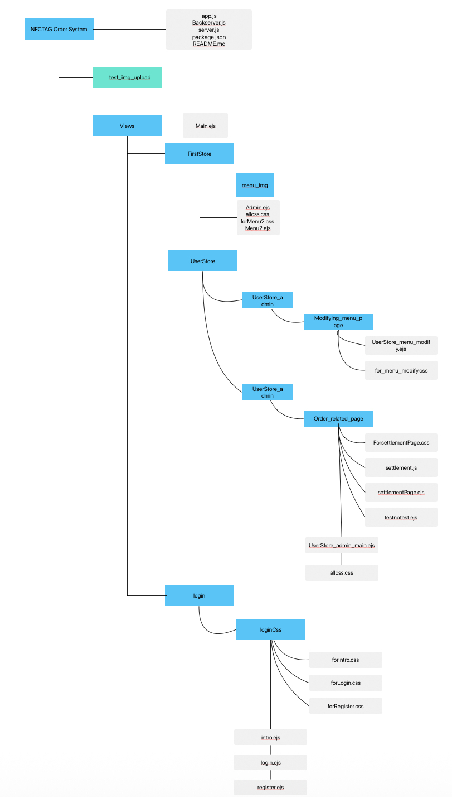
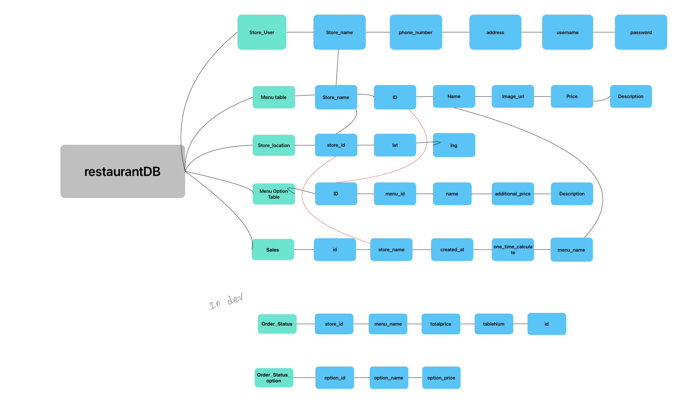

NFC_TAG_Order_System
=============
***
충북대학교 졸업 프로젝트

NFC를 이용한 비접촉 주문 시스템

***
File FlowChart
---------

## NFCTAG Order System File
### app.js
DB연결, 사용자 기능 처리 파일

### Backserver.js
테스트용 로컬서버 실행 파일
로컬에서 열리기에 https프로토콜 관련기능은 없음

### server.js
실제 배포 서버 실행파일
***
## public
클라이언트에게 제공되는 정적파일 모음

### img
식당 관리자가 사진 업로드 시 저장되는 폴더

### js
view폴더 내부에 있는 ejs를 위한 js 파일이 모인 폴더

### css 
view폴더 내부에 있는 ejs를 위한 css 파일이 모은 폴더

***
## Views

### Main.ejs
접속할 때 해당 페이지를 통하여 gps api를 활성화, 사용자의 현재 위치를 계산하여 관리자가 설정한 위치에 있는지 확인 후, menulist.ejs로 랜더하는 페이지
***
## FirstStore
모든 상점이 등록한 메뉴를 확인하는 페이지, 개발자만 접근할 수 있는 페이지이다.
실제 서비스를 한다면 이 파일은 지워야한다.

### menu_img
각 상점마다 이미지를 저장하기 위한 파일, 단순히 파일만 만들어 놓고 기능은 하지 않음

### admin.ejs
개발자용 관리자 페이지.
이곳에서 관리자는 메뉴 업로드, 세부 메뉴 설정 상황을 지켜볼 수 있다.

### allcss.css
admin.ejs용 css파일

### forMenu2.css
테스트용 고객페이지 css 파일

### Menu2.ejs
고객이 사용하게 될 메뉴 페이지를 테스트하는 파일 
___
## UserStore
실제 사용자들에게 보여지는 파일들이 모인 폴더

### UserStore_admin
식당 관리자가 사용하는 파일이 모인 폴더

### Modifying_menu_page
식당 메뉴,옵션을 추가 삭제와 같은 관리하는 페이지

### Order_related_page
고객이 주문한 메뉴를 확인, 정산, 취소, 일일매출 확인하는 페이지

### UserStore_admin_main
Modifying_menu_page,Order_related_page 접근 및 가게 gps저장, 테이블 접속 링크와 qr을 생성하는 페이지 등 모든 가게 관리에 필요한 기능을 접근하는 페이지
___
## login
본 시스템의 메인 접속 경로, 식당 관리자의 로그인,회원가입 페이지가 있는 폴더

### intro
본 시스템의 소개 및 관리자 로그인, 회원가입을 안내하는 페이지
설정한 주소에 접속하면 보이는 페이지이다.

### login
식당 관리자가 로그인 하는 페이지

### register
식당 관리자가 회원가입을 하기 위한 페이지

# DataBase Chart in development

기본적인 상점들의 메뉴 데이터베이스 흐름도

## Store_User Table
식당 관리자의 회원가입 정보, 가게 이름이 저장되는 테이블

Store_name : 회원가입시 설정한 식당 이름이 저장되는 컬럼
Phone_number :  회원가입시 입력한 전화번호가 저장되는 컬럼
address : 식당 주소를 저장하는 컬럼
username : 로그인에 사용되는 ID를 저장하는 컬럼
password : 로그인에 사용되는 password를 저장하는 컬럼

## Menu table
관리자가 추가한 메뉴의 정보가 담기는 테이블이다.

Store_name : 식당 이름이 저장된다. 어떤 식당에서 저장한 메뉴인지 확인하는 용도로 사용된다. Store_User테이블의 Store_name키와 외래키로 지정되어있다.
ID : 메뉴를 식별하기 위한 INT형 ID이다.
Name : 메뉴 이름이 저장되는 컬럼
image_url : 메뉴를 추가할 때 선택한 메뉴 이미지가 어디에 담겨있는지 저장하는 컬럼이다. public폴더 내부에 있는 img 폴더에 저장되므로 거의 이미지 이름이 저장된다고 볼 수 있다.
Price : 메뉴 가격이 저장되는 컬럼
Description : 메뉴 설명이 저장되는 컬럼

## Store_locaiton
gps저장 기능 사용 시, 위도 경도의 정보를 담는 테이블이다.

store_id : 어느 식당인지 식별하기 위한 컬럼으로, Store_User의 Store_name의 외래키로 지정되어있다.
lat : 현재 위치의 위도(Latitude) 정보가 담기는 컬럼
lng : 현재 위치의 경도(Longitude) 정보가 담기는 컬럼

## Menu Option 
Menu table에서 저장한 메뉴의 추가 옵션을 저장하기 위한 테이블

ID : 메뉴의 ID를 참조하기 위한 외래키이다. Menu Table의 ID의 외래키로 지정되어있다.
menu ID : 추가옵션 메뉴를 식별하기 위한 INT형 ID이다.
name : 추가옵션의 이름을 저장하기 위한 컬럼
additional_price : 추가옵션의 가격을 저장하기 위한 컬럼
Description : 추가 옵션의 설명이 저장되는 컬럼

## Sales
식당 매출 정보를 저장하는 테이블이다.

id : 매출 정보를 식별하기 위한 INT형 ID이다.
store_name : 어느 식당에서 저장한 정보인지 식별하기 위한 외래키, Store_User테이블의 Store_name의 외래키로 지정되어있다.
creted_at : 언제 정산하였는지 식별하기 위한 년월일-시분초의 정보가 담기는 컬럼이다. 입력된 순간 자동으로 정보를 저장한다.
one_time_calculate : 한 테이블 카드 당 정산한 총 가격이 저장되는 컬럼이다.
menu_name : 정산한 메뉴의 이름이 저장되는 컬럼이다. Menu Table에 있는 Name와 외래키로 지정되어있다.

## 개발중 혹은 개발 중지한 DB
## Order_Status
메뉴 주문 시 주문내역을 DB에 저장하여 서버가 다운되어도 남아있을 수 있도록 하려 했지만, 웹소켓의 도입, 귀찮기도 해서 패스함

## Order_Status_option 
위 테이블과 동일하게 옵션 내역을 저장하려고 했으나, 웹소켓도입으로 패스

***
## 진행상황 25/05/20

대부분의 기능이 작동하여 서비스 가능 수준
편의성 측면기능
장바구니 기능, QR코드 생성시 이미지 다운 불편, 결제 시스템 없음 등과 같은 기능이 부재
추후 위 기능을 제작하면 좋지 않을까
